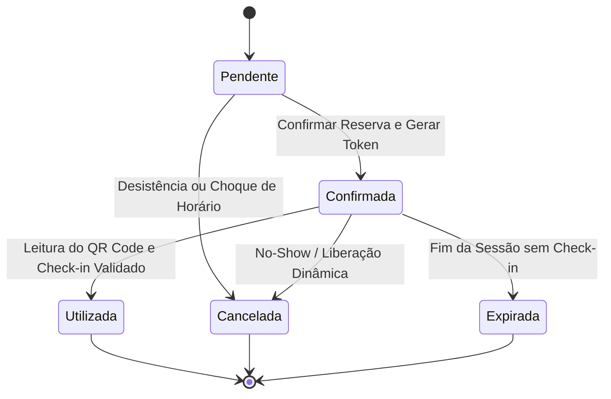
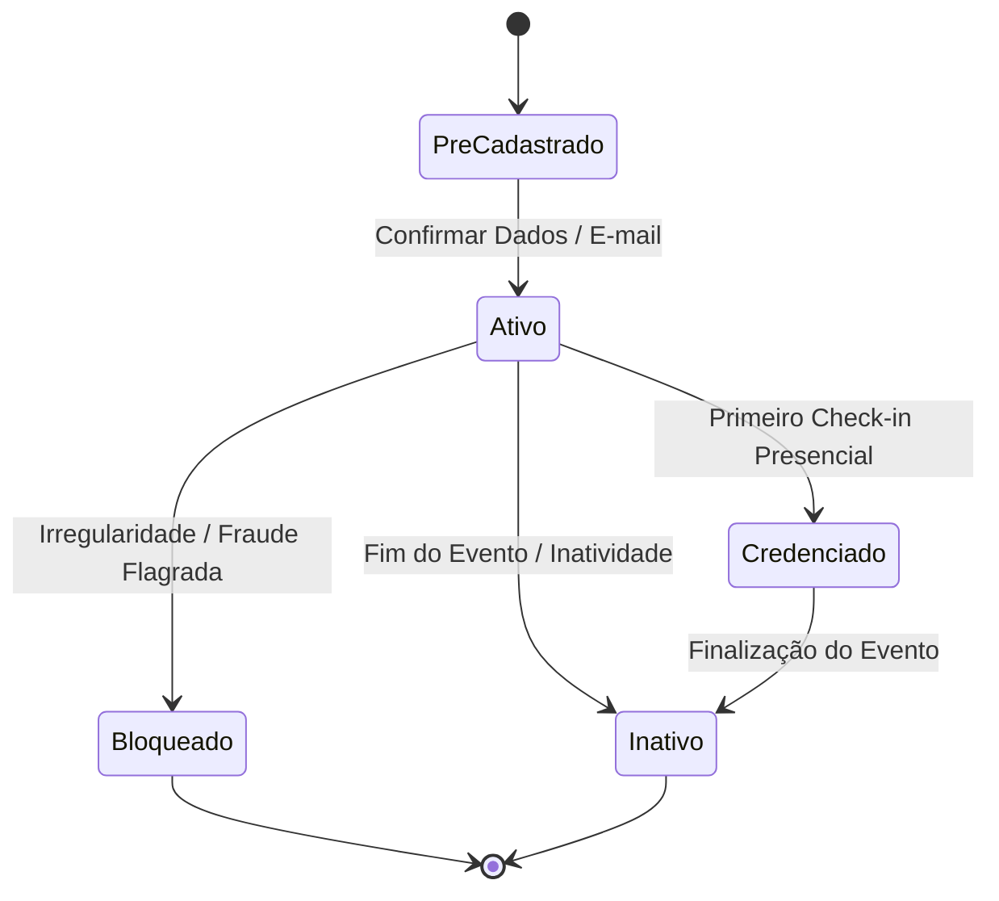
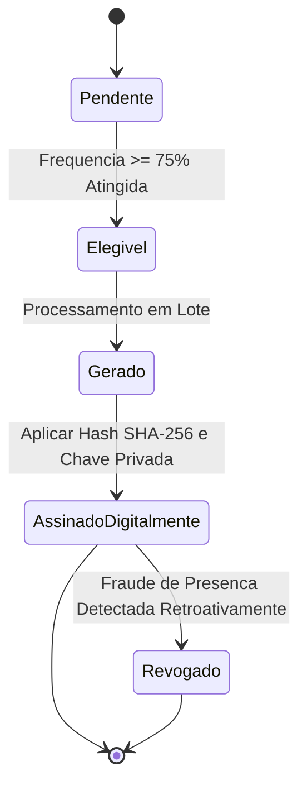
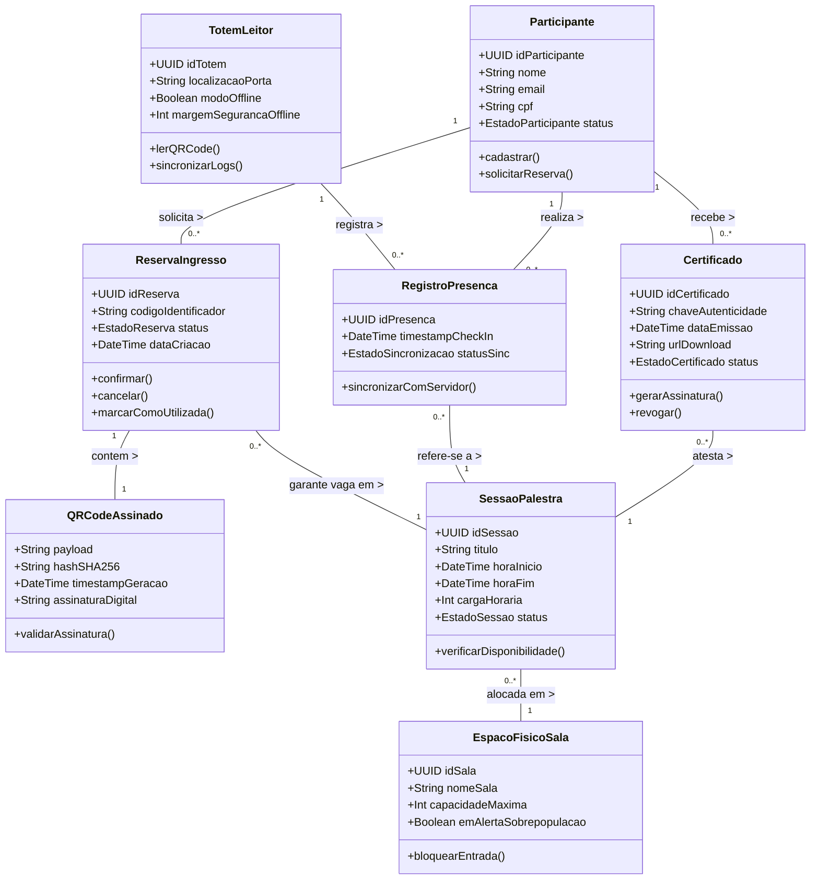

# Modelagem Conceitual do Domínio do Sistema — Total Eventos
**Trabalho:** Da Informação ao Domínio: Construindo o Modelo Conceitual do Sistema  
**Sistema Analisado:** Total Eventos  
**Data:** 21 de Setembro de 2026 
**Formato:** Documento Completo de Modelagem Conceitual (Markdown)

---

## 01. Apresentação e Síntese do Sistema

### Nome do Sistema
**Total Eventos**

### Problema Central
Em eventos de médio e grande porte, a gestão descentralizada e manual provoca filas extensas no credenciamento presencial, sobrecarga física em auditórios com risco de sobrepopulação, choques de horário na agenda dos participantes e falhas na consolidação da frequência para a emissão de certificados oficiais.

### Contexto
O sistema opera em centros de convenções, auditórios acadêmicos e complexos de eventos corporativos. Esses locais caracterizam-se por picos altíssimos de acessos simultâneos no início das sessões e por conectividade de rede (Wi-Fi e 4G/5G) sabidamente instável ou inexistente no momento de maior fluxo.

### Público ou Atores Principais
* **Participante:** Consulta a programação, realiza reservas prévias de vagas nas palestras e apresenta seu ingresso com token/QR Code na entrada.
* **Comissão Organizadora / Operador:** Cadastra o evento, define a grade e o limite de vagas das salas, gerencia cotas VIP/Especiais e atua no desbloqueio manual ou tratamento de alertas de sobrepopulação.
* **Totem / Leitor Autônomo:** Ponto de validação no credenciamento presencial que lê a credencial criptográfica do participante, valida os limites locais (em modo online ou offline) e registra a entrada física.

### Objetivo da Solução
Garantir a fluidez no credenciamento presencial com tempo de resposta inferior a 150ms, assegurar o cumprimento rigoroso da capacidade física legal dos espaços contra incêndios e overbooking, e automatizar a emissão auditável e infalsificável de certificados com base na frequência real dos participantes.

### Fluxos e Operações Principais
1. **Consulta e Reserva Lógica de Vagas:** Escolha da palestra na grade com verificação automática de choque de horários e cota de vagas.
2. **Credenciamento Presencial e Validação do Token:** Leitura do QR Code criptográfico assinado pelo leitor/totem e validação da capacidade em tempo real.
3. **Registro do Check-in e Controle de Lotação:** Gravação da presença física com carimbo temporal e bloqueio estrito em caso de capacidade máxima atingida.
4. **Consolidação de Frequência e Emissão de Certificado:** Verificação pós-evento do atingimento da carga horária mínima (ex: 75%) e assinatura digital do documento com hash SHA-256.

### Informações que o Sistema Precisa Conhecer e Preservar
* Identidade do participante e histórico de reservas e presenças.
* Programação detalhada das palestras, horários de início/término e alocação de salas.
* Capacidade física máxima legal e saldo de vagas em tempo real de cada espaço.
* Credenciais de credenciamento (tokens com hash criptográfico, timestamp e assinatura).
* Registros auditáveis de check-in e certificados emitidos com chave de verificação.

---

## 02. Rastreabilidade do Conhecimento Anterior

| Elemento Anterior | Descrição Resumida | Como Influencia a Modelagem Atual |
| :--- | :--- | :--- |
| **Fluxo:** Credenciamento em Leitor Offline (T3)| Validação local do participante em totens sem conexão com a internet. | Exige tratar a credencial como **Token/QR Code Assinado** imutável com tempo de expiração e o **Totem/Leitor** como nó autônomo. |
| **Operação:** Registro de Check-in (T2/T3) | Gravação da entrada física do participante com data, hora e ID da sala. | Deriva o conceito **Registro de Presença (Check-in)**, conectando o Participante, a Sessão e o Totem. |
| **Informação:** Capacidade Máxima Legal da Sala (T2/T3) | Lotação máxima permitida por razões de segurança contra incêndio. | Define a entidade **Espaço Físico / Sala** e impõe a principal invariante de consistência do sistema. |
| **Fato:** Redes de Wi-Fi e 4G oscillation nos auditórios (T1/T3)| Centros de convenções perdem conectividade nos picos de credenciamento. | Confirma a necessidade do **Totem / Leitor** gerenciar estado local temporário de validação. |
| **Hipótese:** Check-in automático via Geolocalização Mobile (H05 - T1)| Ideia inicial de fazer check-in pelo app do celular ao entrar no raio do prédio. | **Descartada no T3.** Reforça que a validação depende exclusivamente da leitura presencial da credencial no **Totem/Leitor**. |
| **Incerteza/Questão:** Reconciliação concorrente de totens offline simultâneos (Q01 - T3)| Conflitos de duplo check-in quando múltiplos leitores operam desconectados. | Deriva a necessidade de regras como a **Margem de Segurança Offline** e o **Alerta de Sobrepopulação**. |
| **Decisão:** Credenciamento Offline-First com Margem de Contenção (ADR-001 - T3)| Uso de reservas locais contidas em totens para evitar estouro ao reconectar. | Define a **Margem de Segurança Offline** como parâmetro contingencial de controle. |

---

## 03. Candidatos a Conceitos do Domínio

| # | Conceito Candidato | De onde surgiu? | Por que parece relevante? | Grau de Certeza e Validação |
| :-: | :--- | :--- | :--- | :--- |
| **1** | **Participante** | Fluxo principal / Informação necessária | Identifica o indivíduo que navega pela grade, reserva vagas, realiza o check-in presencial e recebe a certificação. | **Confirmado (Certeza):** Elemento central irremovível do domínio. |
| **2** | **Reserva / Ingresso** | Operação de inscrição | Registra formalmente a intenção e o direito de acesso do participante a uma sessão específica da programação. | **Confirmado (Certeza):** Garante a vaga lógica no pré-evento. |
| **3** | **QR Code Assinado (Token)** | Credenciamento presencial | Servidor gera credencial criptográfica com timestamp para autenticação rápida e segura em leitores offline. | **Confirmado (Certeza):** Necessário para a validação offline < 150ms. |
| **4** | **Sessão / Palestra** | Programação do evento | Delimita uma atividade na grade do evento, com horários de início e término, palestrante e sala alocada. | **Confirmado (Certeza):** Entidade agregadora de tempo e conteúdo. |
| **5** | **Espaço Físico / Sala** | Requisito de capacidade física | Define o local da atividade e impõe o limite teto de pessoas permitidas por razões de segurança física. | **Confirmado (Certeza):** Sustenta a invariante de capacidade legal. |
| **6** | **Totem / Leitor** | Operação de credenciamento | Ponto físico de leitura que lê o token, valida a regra local e registra a entrada do participante. | **Confirmado (Certeza):** Agente de validação distribuída no credenciamento. |
| **7** | **Registro de Presença (Check-in)** | Operação de entrada | Evento de validação presencial registrado no ato do acesso para comprovar a presença real e computar horas. | **Confirmado (Certeza):** Base para auditoria e certidão de horas. |
| **8** | **Certificado** | Pós-evento / Consolidação | Documento oficial assinado digitalmente que comprova que o participante cumpriu a carga horária mínima. | **Confirmado (Certeza):** Entregável final do participante pós-evento. |
| **9** | **Margem de Segurança Offline** | Regra contingencial de lotação (ADR-001) | Parâmetro percentual alocado para totens offline para conter estouros concorrentes de lotação. | **Consolidado (Regra/Objeto de Valor):** Validado como parâmetro da sala para mitigar o problema Q01 em totens desconectados. |
| **10** | **Cota VIP / Reserva Especial** | Regra de alocação de vagas (T2) | Reserva preventiva de percentual de vagas das salas exclusivamente para palestrantes, imprensa e organizadores. | **Consolidado (Objeto de Valor):** Validado como estrutura de partição do teto de capacidade da sessão. |
| **11** | **Alerta de Sobrepopulação** | Operação de monitoramento de risco | Notificação emitida ao operador quando a sala atinge o limite máximo e exige travamento de portas. | **Consolidado (Evento de Domínio):** Validado como o sinalizador do estouro de capacidade que aciona a segurança física. |
| **12** | **Redistribuição Dinâmica (No-Show)** | Funcionalidade de otimização (T3) | Algoritmo que cancela reservas lógicas de ausentes para reabrir vagas a participantes da fila presencial. | **Consolidado (Política do Domínio):** Validado como política ativada 10 minutos após o início da palestra. |

---

## 04. Investigação de Identidade

| Conceito | Identidade parece relevante? | Evidência / Justificativa | Classificação Atual |
| :--- | :-: | :--- | :--- |
| **Participante** | **Sim** | Duas pessoas podem ter exatamente os mesmos dados de nome ou e-mail digitados incorretamente, mas continuam sendo indivíduos distintos. Seus dados mudam ao longo do tempo (e-mail, telefone) sem alterar quem ele é no evento. | Possui Identidade do Domínio |
| **Reserva / Ingresso** | **Sim** | Possui ciclo de vida que interessa ao negócio (`Pendente` $\rightarrow$ `Confirmada` $\rightarrow$ `Utilizada` / `Cancelada`). Precisa ser consultada e rastreada individualmente para impedir duplicidade de uso na catraca. | Possui Identidade do Domínio |
| **QR Code Assinado (Token)** | **Não** | Trata-se de uma credencial estática definida unicamente por seu conteúdo (payload com hash + timestamp + assinatura). Dois tokens com exatamente o mesmo valor e timestamp são indistinguíveis. | Não possui Identidade própria |
| **Sessão / Palestra** | **Sim** | Mesmo que duas palestras tenham o mesmo título e palestrante (ex: duas edições no mesmo dia), são ocorrências distintas da grade. Possui ciclo de vida e horários que mudam sem mudar a atividade. | Possui Identidade do Domínio |
| **Espaço Físico / Sala** | **Sim** | O local físico mantêm sua identidade (ex: "Auditório Bloco A"). Seus atributos como capacidade máxima permitida ou quantidade de portas podem ser atualizados sem trocar a sala. | Possui Identidade do Domínio |
| **Totem / Leitor** | **Sim** | Representa um nó físico de hardware autônomo com identificador próprio. O negócio precisa reconhecer qual leitor registrou cada check-in para fins de auditoria e contingência offline. | Possui Identidade do Domínio |
| **Registro de Presença (Check-in)** | **Sim** | É a representação de um fato de acesso ocorrido que possui ciclo de vida operacional (`Pendente de Sincronização` $\rightarrow$ `Sincronizado`) e precisa ser auditado unicamente pelo sistema. | Possui Identidade do Domínio |
| **Certificado** | **Sim** | É um documento formal e individualizado. Possui ciclo de vida (`Gerado` $\rightarrow$ `Assinado Digitalmente` $\rightarrow$ `Revogado`) e exige verificação posterior por terceiros via chave de autenticidade única. | Possui Identidade do Domínio |

---

## 05. Entidades, Objetos de Valor e Outros Conceitos

| Conceito | Classificação Atual | Justificativa | Evidência | Grau de Certeza |
| :--- | :--- | :--- | :--- | :-: |
| **Participante** | **Entidade** | Mantém identidade única na jornada do evento. Pode alterar dados cadastrais sem perder o histórico de presenças. | Fluxo de Reserva e Credenciamento. | **Confirmada** |
| **Reserva / Ingresso** | **Entidade** | Precisa ser rastreable ao longo do tempo. Transita por estados e garante o direito de vaga de uma pessoa. | Validação de duplicidade na catraca. | **Confirmada** |
| **QR Code Assinado (Token)** | **Objeto de Valor** | Imutável. Representado e definido exclusivamente pela junção dos seus valores criptográficos, chave e timestamp. | Leitura e autenticação descentralizada no totem. | **Confirmada** |
| **Sessão / Palestra** | **Entidade** | Elemento central da programação. Possui ciclo de vida de alocação de sala e controle de teto de público. | Grade de programação e choque de horários. | **Confirmada** |
| **Espaço Físico / Sala** | **Entidade** | Ocorrência física identificável com limite estrito legal de lotação. | Alvará de segurança física contra incêndios. | **Confirmada** |
| **Totem / Leitor** | **Entidade** | Dispositivo de hardware individualizado que mantém estado local de operação (online/offline) e fila de conciliação. | ADR-001 Operação Offline-First. | **Confirmada** |
| **Registro de Presença (Check-in)** | **Entidade** | Evento único auditável de entrada presencial que sofre transição de sincronização pós-reconexão. | Frequência acumulada para emissão de certificados. | **Confirmada** |
| **Certificado** | **Entidade** | Comprovante oficial com chave SHA-256 e ciclo de vida de assinatura e revogação. | Auditoria externa por instituições ou empregadores. | **Confirmada** |
| **Margem de Segurança Offline** | **Objeto de Valor** | Parâmetro quantitativo alocado às salas para limitar acessos locais em totens desconectados sem estourar o alvará. | Estratégia de contenção de overbooking offline (ADR-001). | **Confirmada** |
| **Cota VIP / Reserva Especial** | **Objeto de Valor** | Especificação de regra de distribuição de vagas (ex: "10% das vagas para palestrantes"). | Regra de alocação no Módulo de Inscrição. | **Confirmada** |
| **Alerta de Sobrepopulação** | **Evento de Domínio** | Notificação emitida quando a ocupação física atinge 100% da capacidade permitida do recinto. | Fluxo de bloqueio emergencial no leitor. | **Confirmada** |
| **Redistribuição Dinâmica (No-Show)** | **Política do Domínio** | Regra de negócio executada automaticamente N minutos após o início da palestra para cancelar reservas de ausentes. | Estudo de no-show em grandes eventos (T3). | **Confirmada** |

---

## 06. Casos de Classificação Ambígua

### Caso Ambíguo 1: Registro de Presença (Check-in)
* **Classificação inicialmente considerada:** Objeto de Valor (um simples registro imutável com data/hora).
* **Dúvida encontrada:** Por ser um evento de acesso ocorrido no tempo, parecia apenas um fato imutável sem necessidade de id. Porém, no credenciamento em redes instáveis, o check-in é capturado localmente no totem em modo offline com o estado `Pendente de Sincronização` e, posteriormente, precisa passar para o estado `Sincronizado` no servidor central, mantendo o histórico de conciliação.
* **Alternativas analisadas:**
  1. *Objeto de Valor:* Descartado, pois exige acompanhamento da sua transição de estado de sincronização e reconciliação.
  2. *Entidade:* Aceito, pois possui ciclo de vida de conciliação no domínio e necessita de identificação auditável para a emissão do certificado pós-evento.
* **Evidências disponíveis:** Fluxo do ADR-001 e arquitetura de reconciliação offline dos totens leitores.
* **Classificação atual:** **Entidade**.
* **Grau de certeza:** Confirmada.
* **Informação que poderia alterar:** Se o credenciamento funcionasse exclusivamente 100% online, sem totens e sem retentativa de envio de dados, o check-in poderia ser traduzido apenas como um log/evento histórico imutável.

### Caso Ambíguo 2: QR Code Assinado (Token)
* **Classificação inicialmente considerada:** Entidade (pensando no "ingresso digital" que o participante carrega no celular).
* **Dúvida encontrada:** O QR Code precisa ser rastreado individualmente como uma entidade separada da reserva?
* **Alternativas analisadas:**
  1. *Entidade:* Exigiria ciclo de vida e estado próprio mantido em banco de dados.
  2. *Objeto de Valor:* Vê o token como um simples vetor de dados imutável assinado criptograficamente (payload contendo ID do Participante, ID da Sessão, Carimbo de Data/Hora e Assinatura SHA-256).
* **Evidências disponíveis:** Leitura ultra-rápida offline (< 150ms) nos leitores. O leitor valida a autenticidade do token puramente inspecionando a chave pública e a matemática da assinatura, sem consultar uma tabela de tokens.
* **Classificação atual:** **Objeto de Valor**.
* **Grau de certeza:** Confirmada.
* **Informação que poderia alterar:** Se houvesse a necessidade de revogação/invalidar individualmente e dinamicamente um único QR Code mantendo a mesma reserva ativa (ex: regenerar token por vazamento de print-screen em tempo real), o token ganharia ciclo de vida e viraria uma Entidade.

---

## 07. Relações entre Conceitos

| Conceito A | Relação (Verbo) | Conceito B | Significado no Domínio | Evidência |
| :--- | :--- | :--- | :--- | :--- |
| **Participante** | solicita | **Reserva / Ingresso** | Um indivíduo cadastrado solicita e possui o direito formal de vaga em uma atividade. | Fluxo de inscrição e seleção de palestras. |
| **Reserva / Ingresso** | garante vaga em | **Sessão / Palestra** | A reserva vincula o participante a uma sessão específica, debitando do saldo lógico. | Controle de limite de vagas e no-show. |
| **Sessão / Palestra** | ocorre em | **Espaço Físico / Sala** | A sessão é alocada em uma sala física que possui teto máximo legal de capacidade. | Tabela de alocação da grade e alvará da sala. |
| **Totem / Leitor** | executa | **Registro de Presença (Check-in)** | O leitor autônomo lê o QR Code, valida as regras e registra o evento de entrada do participante. | Operação do leitor no credenciamento. |
| **Registro de Presença (Check-in)** | comprova presença em | **Sessão / Palestra** | O check-in auditável comprova a presença física do participante na palestra. | Cômputo de horas para a lista de frequência. |
| **Participante** | cumpre requisitos para | **Certificado** | O acúmulo de check-ins em sessões dá ao participante o direito de emissão do certificado. | Regra de elegibilidade por frequência mínima. |
| **Reserva / Ingresso** | gera | **QR Code Assinado (Token)** | Ao ser confirmada, a reserva gera a credencial criptográfica imutável para a catraca. | Módulo de geração de token com assinatura. |

---

## 08. Cardinalidades

| Relação | Cardinalidade Atual | Justificativa do Escopo e Consolidação | Grau de Certeza |
| :--- | :-: | :--- | :-: |
| **Participante** solicita **Reserva / Ingresso** | `1 : N` | Um participante pode possuir N reservas no evento, mas cada reserva pertence a exatamente 1 participante. | **Confirmada** |
| **Reserva / Ingresso** garante vaga em **Sessão / Palestra** | `N : 1` | Múltiplas reservas garantem vaga para 1 palestra, mas cada reserva refere-se a apenas 1 palestra. | **Confirmada** |
| **Sessão / Palestra** ocorre em **Espaço Físico / Sala** | `N : 1` | **Consolidada como N:1 no escopo oficial.** Cada sessão ocorre em uma única sala física para fins de alocação de espaço e controle estrito de capacidade legal do alvará. O cenário de transmissão simultânea em salas de apoio (N:M) foi descartado do escopo principal para evitar ambiguidade no controle de lotação. | **Confirmada** |
| **Totem / Leitor** executa **Registro de Presença (Check-in)** | `1 : N` | Um totem realiza N registros de check-in, mas cada registro é efetuado por 1 totem específico. | **Confirmada** |
| **Participante** cumpre requisitos para **Certificado** | `1 : N` | Um participante pode obter N certificados ao longo do evento, mas cada certificado é emitido individualmente para 1 participante. | **Confirmada** |

---

## 09. Regras de Negócio e Mecanismos de Aplicação

| ID | Regra de Negócio | Conceitos Envolvidos | Como o Sistema Aplica e Protege a Regra | Origem / Evidência | Situação |
| :--- | :--- | :--- | :--- | :--- | :-: |
| **RN01** | **Validação de Duplicidade de Acesso:** Um mesmo Ingresso/Reserva não pode ser utilizado para realizar check-in mais de uma vez na mesma sessão. | Reserva, QR Code, Check-in, Totem | O Totem mantém uma tabela local em memória (cache/SQLite) com o hash dos QR Codes já lidos na sessão corrente, rejeitando leituras duplicadas instantaneamente em < 50ms. | Fluxo de credenciamento e verificação antifraude. | **Confirmada** |
| **RN02** | **Trava por Limite Físico Legal de Lotação:** A quantidade total de check-ins presenciais efetuados em uma sessão não pode ultrapassar a capacidade máxima declarada da Sala. | Sessão, Espaço Físico, Check-in, Totem | O sistema decrementa o contador de vagas local/remoto a cada check-in. Ao atingir `capacidadeMaxima`, o Totem bloqueia a entrada, acende sinalizador vermelho e dispara um `Alerta de Sobrepopulação` para os organizadores. | Invariante de segurança contra incêndios. | **Confirmada** |
| **RN03** | **Elegibilidade para Certificação:** O Certificado de uma palestra só pode ser gerado para o participante que acumular frequência registrada maior ou igual ao percentual mínimo (ex: 75%). | Participante, Check-in, Certificado | O módulo de consolidação calcula `(soma das horas presenciais / carga horária total da sessão) * 100`. Apenas se o resultado for $\ge 75\%$, a rotina libera o botão de download e assina o documento via hash SHA-256. | Fluxo de consolidação de atas e carga horária. | **Confirmada** |
| **RN04** | **Prevenção de Choque de Horários:** É proibido confirmar uma reserva para o participante em sessões com horários coincidentes. | Participante, Reserva, Sessão| Na requisição de reserva, a API executa uma consulta de intersecção de intervalos `(InicioA < FimB) e (FimA > InicioB)` nas reservas ativas do participante, bloqueando a confirmação se houver sobreposição. | Módulo de Inscrição e Programação. | **Confirmada**|
| **RN05** | **Contenção por Margem Offline:** Quando desconectado da rede, um Totem só pode autorizar check-ins até atingir o teto de segurança da Margem Offline alocada. | Totem, Margem Offline, Espaço Físico | Ao perder conexão, o Totem calcula `CapacidadeDisponivelLocal = VagasAlocadas - PresencasLocais`. Atingido este teto sem sincronizar, o Totem exige validação manual do operador via senha. | Decisão de Arquitetura ADR-001 (T3). | **Confirmada** |

---

## 10. Invariantes e Proteção da Consistência

| Conceito Protegido | Possível Invariante | O que poderia violá-la? | Consequência | Evidência |
| :--- | :--- | :--- | :--- | :--- |
| **Espaço Físico / Sala** | O total de pessoas credenciadas presentes no recinto NUNCA deve ultrapassar a `capacidadeMaxima` legal da Sala. | Múltiplos totens operando em modo offline liberando acessos simultâneos sem comunicação de rede. | Risco de sobrepopulação, multa legal por violação de norma contra incêndios e necessidade de bloqueio manual imediato. | Alvará de segurança e Invariante de Lotação (T2/T3). |
| **Reserva / Ingresso** | Uma reserva NÃO pode transitar para o estado `Utilizada` mais de uma vez. | Tentativa de fraude com reuso de print-screen de QR Code por múltiplos indivíduos em catracas diferentes. | Acesso não autorizado, superlotação fraudulenta da sala e invalidação das métricas de presença. | Requisito Antifraude de Credenciamento. |
| **Certificado** | Um Certificado NUNCA pode ser assinado e liberado para participante com frequência inferior a 75% da carga horária. | Falha na consolidação de atas offline ou adulteração no cálculo de presenças. | Emissão ilícita de comprovante oficial e perda de credibilidade auditável do evento. | Regra de Certificação e Auditoria. |

---

## 11. Estados e Ciclo de Vida

### 11.1 Conceito Chave Principal: Reserva / Ingresso
* **Estado Inicial:** `Pendente` (criada ao selecionar a vaga).
* **Estados Intermediários:** `Confirmada` (garantida com emissão do token), `Em Credenciamento` (sendo lida na portaria).
* **Estados Finais:** `Utilizada` (check-in realizado com sucesso), `Cancelada` (por desistência ou no-show), `Expirada` (não utilizada até o fim da sessão).
* **Transições Válidas:**
  * `Pendente` $\rightarrow$ `Confirmada` (ao validar vaga e gerar token).
  * `Confirmada` $\rightarrow$ `Utilizada` (ao realizar check-in no leitor).
  * `Confirmada` $\rightarrow$ `Cancelada` (por solicitação do participante ou regra de no-show).
* **Transições Inválidas:**
  * `Utilizada` $\rightarrow$ `Confirmada` (proibido reaproveitar ingresso usado).
  * `Cancelada` $\rightarrow$ `Utilizada` (ingresso cancelado não entra na sala).

### 11.2 Conceito Chave Adicional: Participante

* **Estados:** `Pré-Cadastrado` $\rightarrow$ `Ativo` $\rightarrow$ `Credenciado` / `Inativo` / `Bloqueado`.
* **Descrição do Ciclo de Vida:** O participante inicia como `Pré-Cadastrado` ao preencher os dados básicos. Torna-se `Ativo` ao confirmar e-mail/CPF. Ao efetuar a entrada no evento, transita para `Credenciado`. Pode ser marcado como `Inativo` após o evento ou `Bloqueado` em caso de irregularidades flagradas no credenciamento.

### 11.3 Conceito Chave Adicional: Certificado

* **Estados:** `Pendente` $\rightarrow$ `Elegível` $\rightarrow$ `Gerado` $\rightarrow$ `Assinado Digitalmente` / `Revogado`.
* **Descrição do Ciclo de Vida:** Permanece `Pendente` enquanto as aulas da palestra ocorrem. Ao atingir a frequência mínima de 75%, transita para `Elegível`. O sistema executa a rotina de emissão passando para `Gerado` e, em seguida, aplica o hash SHA-256 resultando em `Assinado Digitalmente`. Caso seja identificada fraude retroativa na presença, o certificado pode ser transicionado para `Revogado`.

---

## 12. Modelo Conceitual Visual do Sistema (Diagrama de Classes Completo)

---

## 13. Explicação do Modelo Conceitual

* **Por que cada conceito principal está presente:**
* **Participante, Sessão e Sala:** Representam o "quem", o "o quê" e o "onde" fundamentais do domínio de eventos.

* **Reserva/Ingresso:** Garante o vínculo lógico de reserva prévia e previne superlotação lógica.

* **QR Code Assinado:** Objeto de Valor essencial para garantir o credenciamento presencial seguro e desacoplado de rede.

* **Totem/Leitor e Check-in:** Representam a execução física real do acesso presencial e a criação da prova auditável de presença.

* **Certificado:** Fecha o ciclo de valor do participante, comprovando sua capacitação.

* **Quais elementos possuem identidade:** `Participante`, `ReservaIngresso`, `SessaoPalestra`, `EspacoFisicoSala`, `TotemLeitor`, `RegistroPresenca` e `Certificado`. Todos possuem ciclo de vida, acompanhamento no tempo ou necessidade de auditoria única.

* **Quais foram tratados como Objetos de Valor:** `QRCodeAssinado` (definido unicamente por seus atributos e criptografia imutável) e especificação de cotas/margens.

* **Quais relações são mais importantes:** A cadeia `Participante` $\rightarrow$ `Reserva` $\rightarrow$ `Sessão` $\rightarrow$ `Sala`, pois sustenta todo o controle de lotação, e a cadeia `Totem` $\rightarrow$ `RegistroPresenca` $\rightarrow$ `Certificado`, que garante a idoneidade da emissão do documento.

* **Cardinalidades Confirmadas:** Confirmadas e consolidadas todas as cardinalidades do modelo (incluindo a relação N:1 entre Sessão e Sala no escopo principal).

---

## 14. Evolução do Modelo

| Momento | Alteração Realizada | Motivo | Evidência ou Descoberta que provocou a mudança |
| --- | --- | --- | --- |
| **Identificação Inicial** | Mapeamento de 12 conceitos potenciais.

 | Levantar todas as palavras e operações do domínio.

 | Leitura dos fluxos operacionais e relatórios do T1/T2.

 |
| **Investigação de Identidade** | Diferenciação entre Reserva e QR Code.

 | Entender que o QR Code é apenas uma representação criptográfica imutável da reserva.

 | Análise de performance da leitura offline (<150ms) no totem.

 |
| **Relações** | Vinculação do Check-in diretamente ao Totem e à Sessão.

 | Garantir rastreabilidade de hardware no modo offline.

 | Problema de reconciliação assíncrona Q01 (T3).

 |
| **Cardinalidades** | Consolidação da relação N:1 de Sessão-Sala. | Eliminar ambiguidade do escopo e focar no controle rígido por alvará físico de cada recinto. | Revisão da invariante de segurança física (RN02).

 |
| **Regras e Estados** | Inclusão dos diagramas de ciclo de vida de Participante e Certificado e detalhamento das travas das regras. | Garantir a cobertura total dos estados do sistema e demonstrar a mecânica de proteção das invariantes. | Feedback de refinamento da avaliação técnica. |
| **Modelo Atual** | Modelo conceitual em Mermaid unificado e diagramas completos sem truncamento.

 | Unificar entidades, objetos de valor e cardinalidades com visibilidade 100% dos atributos e métodos.

 | Consolidação final da etapa 12.

 |

---

## 15. Revisões Identificadas em Relação aos Documentos Anteriores

| Documento ou Conhecimento Anterior | Revisão Identificada | Motivo | Impacto Futuro |
| --- | --- | --- | --- |
| **Relatório T1 - Check-in Mobile por Geolocalização (H05)**  | Remover / Descartar.

 | Falta de precisão do GPS em recintos fechados e auditórios subterrâneos.

 | O leitor/totem presencial passa a ser o único meio oficial de validação presencial.

 |
| **Relatório T1 - Papel do Totem**  | Atualizar Classificação.

 | O totem deixou de ser visto como "periférico passivo" e virou um "Nó Autônomo".

 | Exige banco de dados local (SQLite) e regras contingenciais gravadas no leitor.

 |
| **Relatório T3 - ADR-001 Credenciamento Offline**  | Complementar.

 | Necessidade de incluir explicitamente o parâmetro de Margem de Contenção Offline.

 | Previne que totens offline estourem a capacidade da sala durante reconexões concorrentes.

 |

---

## 16. Pendências de Governança

| Item a revisar futuramente | Motivo | Prioridade | Consequência se permanecer desatualizado |
| --- | --- | --- | --- |
| **Documento de Requisitos (T1)** | Contém menção ao check-in por geolocalização mobile que foi descartado.

 | **Média** | Desenvolvedores podem tentar implementar APIs de GPS desnecessárias.

 |
| **Matriz de Casos de Uso** | Especificar a transição do estado do Check-in (`Pendente de Sincronização` $\rightarrow$ `Sincronizado`).

 | **Alta** | Inconsistência na implementação da camada de persistência e reconciliação offline.

 |
| **Especificação de Parâmetros de Contenção** | Definir a fórmula de cálculo da Margem de Segurança Offline dos totens.

 | **Alta** | Risco de estouro acidental da capacidade física de salas em eventos reais.

 |

---

## 17. Análise Crítica do Modelo

1. **Qual parte do modelo possui melhor sustentação?**
A cadeia de `Participante` $\rightarrow$ `Reserva` $\rightarrow$ `QRCodeAssinado` $\rightarrow$ `Check-in` no `Totem`. Possui vasta evidência nos fluxos e no ADR-001 do T3.

2. **Qual conceito possui classificação mais incerta?**
`Margem de Segurança Offline`, que foi consolidada como Objeto de Valor (parâmetro quantitativo da sala), mas que atua na fronteira como regra de negócio operacional.
3. **Qual relação possui justificativa mais frágil?**
A relação N:1 entre `SessaoPalestra` e `EspacoFisicoSala`, que assume a premissa de que toda palestra presencial ocorre em recinto único para fins de validação do alvará.
4. **Qual cardinalidade ainda precisa de validação em escala?**
A quantidade máxima de `TotemLeitor` associados simultaneamente a uma única `EspacoFisicoSala` em termos de gargalo de concorrência.
5. **Qual regra possui maior impacto sobre o modelo?**
RN02 (Trava por Limite Físico Legal de Lotação). Ela força a validação da Sala a sobrepor-se à validação do Ingresso no momento do check-in.

6. **Existe alguma decisão baseada principalmente em intuição?**
A definição do limite de 75% de frequência para emissão do certificado (RN03), que é um padrão de mercado, mas varia por organizador.

7. **Qual hipótese, se rejeitada, provocaria maior mudança?**
Se a hipótese de operar *Offline-First* nos totens for rejeitada (exigindo 100% de conectividade online garantida), os conceitos de `Margem Offline` e os estados de `Sincronização do Check-in` desapareceriam.

8. **Que nova informação poderia modificar significativamente o modelo?**
A introdução de entrada livre sem reserva prévia (venda/liberação de ingressos avulsos na hora por fila presencial).

9. **Qual parte provavelmente será revisada futuramente?**
O tratamento do algoritmo de `No-Show` e reabertura dinâmica de vagas ociosas.

10. **Existe alguma contradição entre este trabalho e a documentação anterior?**
Não. As incoerências anteriores (como o GPS mobile) foram explicitamente mapeadas e corrigidas nas Etapas 15 e 16 deste documento.

---

## 18. Reflexão da Equipe

* **O que foi descoberto sobre o sistema que não estava claro anteriormente?**
Ficou claro que a validação de credenciamento presencial não é uma mera consulta de cadastro, mas um cálculo de contingência de capacidade física que envolve concorrência entre nós leitores.

* **Qual conceito foi mais difícil de classificar?**
O `Registro de Presença (Check-in)`, devido à dúvida se era um simples log de dados imutável ou uma entidade com ciclo de sincronização.

* **Qual relação exigiu maior discussão?**
A relação entre o `TotemLeitor` e o `EspacoFisicoSala` em cenários offline.

* **Alguma informação inicialmente simples passou a ser reconhecida como Entidade?**
O `Totem / Leitor`, que de periférico virou Entidade com responsabilidade de estado local e margem de segurança.

* **Algum conceito inicialmente considerado Entidade deixou de parecer necessário?**
O `QR Code`, que foi reclassificado de Entidade para Objeto de Valor imutável.

* **Alguma cardinalidade aparentemente óbvia revelou-se uma hipótese?**
A cardinalidade de alocação de palestras por sala, que precisou ser cravada em N:1 para manter o rigor do alvará físico.

* **Qual Regra de Negócio mais influenciou o modelo?**
RN02 — Trava por Limite Físico Legal de Lotação da Sala.

* **Qual decisão anterior precisaria ser revisada?**
A eliminação definitiva do requisito de geolocalização via smartphone no T1.

* **O que esta atividade mudou na compreensão do sistema?**
Mudou a visão de um sistema centrado em "cadastros e telas" para um sistema guiado por "invariantes de segurança e resiliência operacional no mundo real".

* **A equipe considera o modelo atual suficientemente fundamentado para sustentar as próximas etapas do projeto? Por quê?**
**Sim.** O modelo conceitual atual está respaldado por evidências operacionais sólidas, separa claramente Entidades de Objetos de Valor e define com precisão as invariantes de negócio que guiarão a futura arquitetura de software e persistência de dados.

