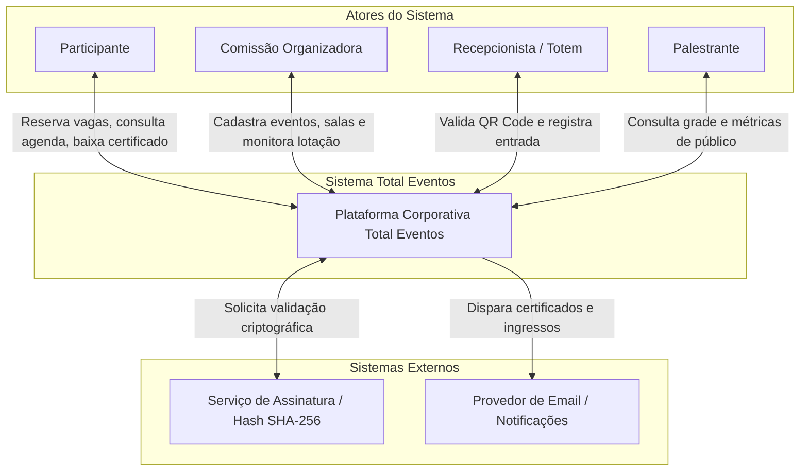
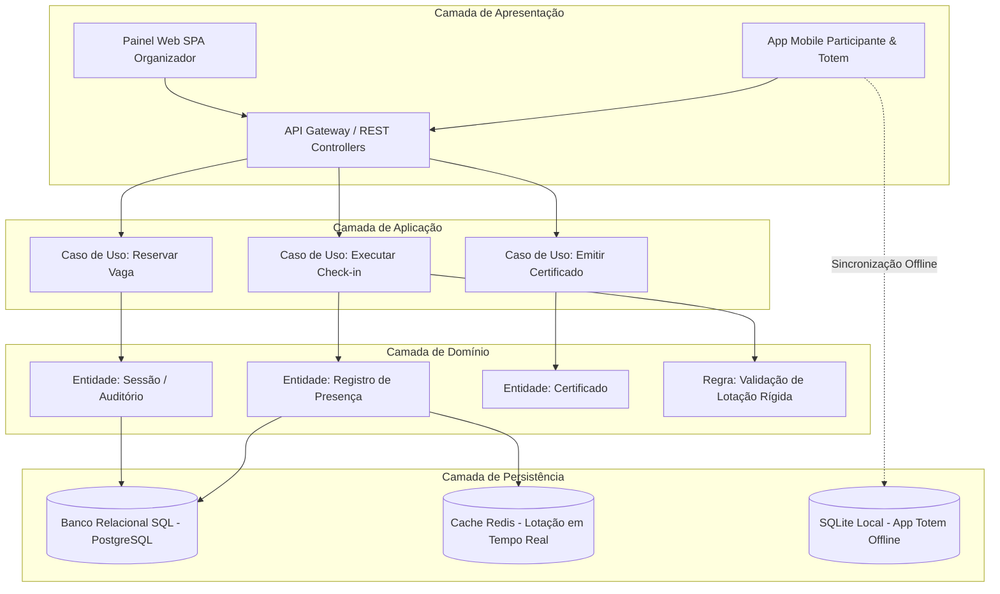
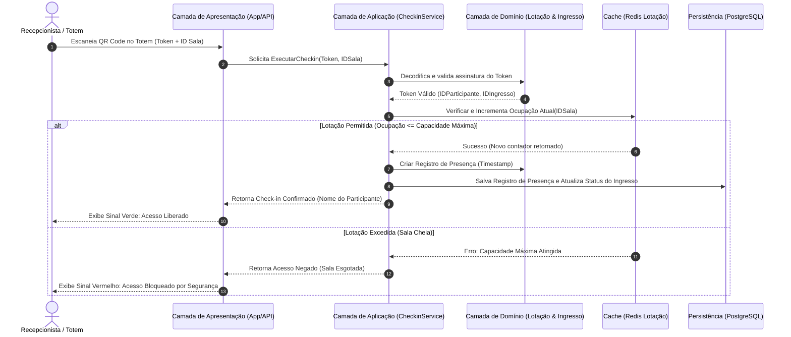
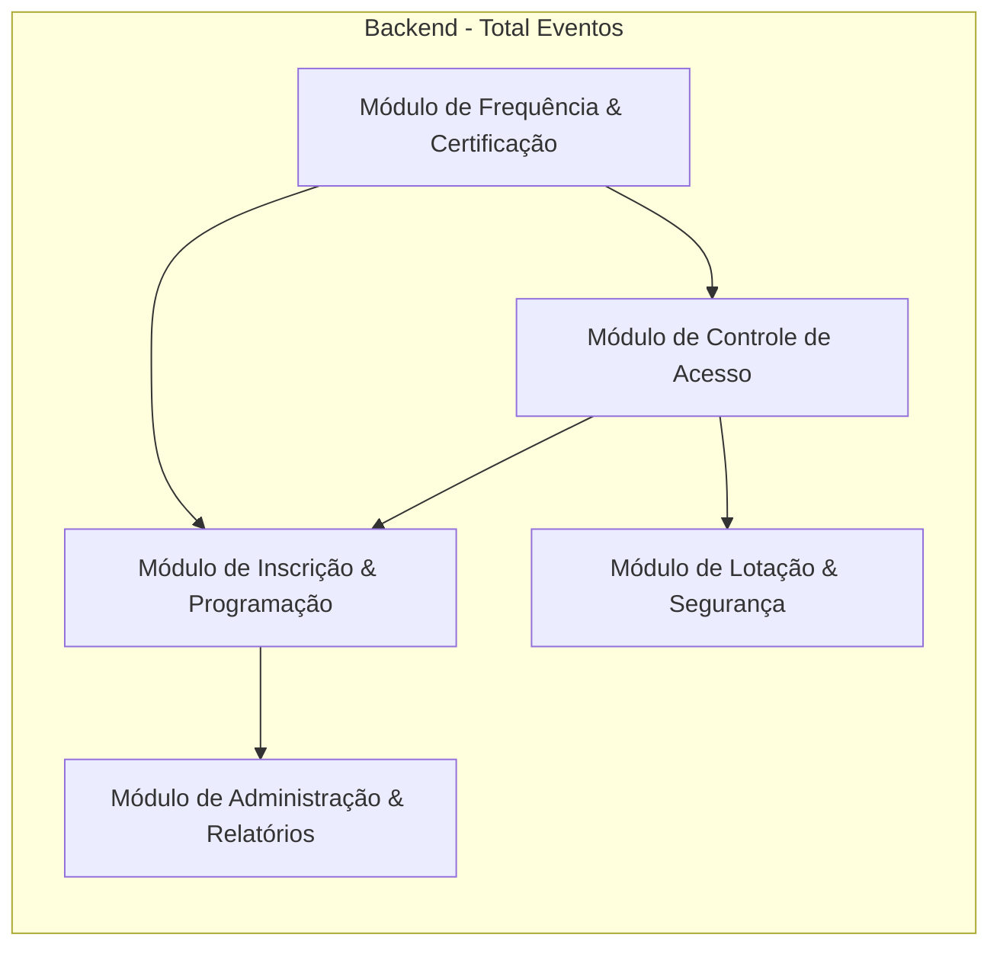

# Documento de Arquitetura de Software (DAS) — Total Eventos

**Disciplina:** Desenvolvimento de Software Corporativo

**Alunos:** Luiz Henrique, Fernando Villar, Emmanuelly Madeira

**Tema:** Plataforma de Organização de Eventos (Total Eventos)

**Data:** 1 de Setembro de 2026

---

## Capa / Identificação

* **Nome do Grupo:** Grupo Total Eventos

* **Integrantes:** Luiz Henrique, Fernando Villar, Emmanuelly Madeira

* **Tema Escolhido:** Plataforma de organização de eventos

* **Disciplina:** Desenvolvimento de Software Corporativo

* **Data de Entrega:** 01/09/2026

---

## 01. Introdução e Descrição do Problema

Em eventos corporativos, acadêmicos e congressos de médio e grande porte (como simpósios, feiras e convenções), a gestão manual ou descentralizada de inscrições, credenciamento e controle de lotação gera filas extensas no check-in, choque de horários de palestrantes, sobrecarga de capacidade física em auditórios e falhas na verificação de frequência mínima para emissão de certificados. A falta de dados em tempo real impede a tomada de decisão rápida pela equipe de organização e compromete a experiência dos participantes e patrocinadores.

O problema manifesta-se em centros de convenções, auditórios corporativos e salas de workshop durante a realização de eventos presenciais ou híbridos com múltiplas trilhas simultâneas de conteúdo. A plataforma **Total Eventos** surge para intermediar e automatizar o ciclo completo de gestão desses eventos, englobando a disponibilização de agenda, inscrição por trilhas, controle de capacidade por auditório em tempo real com resiliência offline, credenciamento via QR Code e emissão automatizada de certificados com autenticação digital via hash SHA-256.

---

## 02. Identificação dos Atores

* **Participante:** Congressista, estudante ou colaborador que navega pela grade de programação, reserva vagas em sessões, apresenta o QR Code para credenciamento e realiza o download dos certificados emitidos.

* **Comissão Organizadora:** Gerentes e coordenadores do evento que cadastram a programação, configuram a capacidade física das salas, monitoram os relatórios de presença em tempo real e encerram as atas do evento.

* **Recepcionista / Totem:** Operador ou dispositivo fixo posicionado na entrada das salas e auditórios para realizar a leitura rápida do QR Code dos participantes, operando em modo online ou offline.

* **Palestrante:** Ator que consulta a sua agenda de apresentações, visualiza a contagem de participantes credenciados em sua sessão e recebe relatórios de engajamento do público.

* **Sistema Externo de Assinatura Digital / Email:** Serviço responsável pela autenticação e assinatura do hash SHA-256 dos certificados, além de efetuar o envio dos documentos por e-mail.

---

## 03. Módulos do Sistema

1. **Módulo de Inscrição e Programação:** Responsável pelo gerenciamento do catálogo de eventos, trilhas temáticas, palestras, agenda dos participantes e reserva de vagas.

2. **Módulo de Controle de Acesso e Credenciamento:** Gerencia a geração de QR Codes criptografados, a validação dos ingressos na entrada dos auditórios e o mecanismo de sincronização offline para evitar paradas na recepção.

3. **Módulo de Lotação e Segurança:** Inspeciona o limite físico de cada sala em tempo real, calculando vagas remanescentes e aplicando regras de reserva de contingência (como cota VIP) para evitar sobrepopulação e riscos de incêndio.

4. **Módulo de Frequência e Certificação:** Computa o tempo e o percentual de permanência dos participantes nas sessões, gera o hash de autenticidade SHA-256 e produz os certificados em PDF.

5. **Módulo de Administração e Relatórios:** Fornece à comissão organizadora dashboards consolidados de presença em tempo real, gestão de palestrantes e exportação de auditoria.

*Justificativa da divisão:* A decomposição foi feita isolando responsabilidades de alta taxa de leitura e escrita crítica em momentos distintos (ex: credenciamento na entrada vs. emissão pós-evento), garantindo coesão e permitindo escalabilidade direcionada.

---

## 04. Arquitetura em Camadas

* **Camada de Apresentação:** Composta por APIs REST/GraphQL, Interfaces Mobile (App do Participante e App do Credenciador) e Painel Web SPA para organizadores. Responsável pela validação de entrada e exibição dos dados.

* **Camada de Aplicação:** Orquestra os casos de uso do sistema (ex: `ExecutarCheckinCredenciamento`, `EmitirCertificadoAutenticado`), aplicando fluxos de trabalho sem conter regras puras de domínio.

* **Camada de Domínio:** Contém a lógica de negócio central, entidades (Participante, Sessão, Espaço Físico, Ingresso, Certificado), agregados e regras de validação de lotação física e carga horária.

* **Camada de Persistência:** Responsável pela abstração de acesso a dados (Repositórios), comunicação com o banco relacional principal, armazenamento em cache no Redis e armazenamento local em SQLite nos dispositivos móveis.

---

## 05. Diagramas Obrigatórios

### 5.1. Diagrama de Ecossistema

O Diagrama de Ecossistema contextualiza o sistema **Total Eventos** com seus atores humanos e sistemas externos parceiros.

### 5.2. Diagrama Arquitetural

Apresenta a estrutura em camadas isoladas com suas respectivas responsabilidades.

### 5.3. Diagrama de Fluxo do Sistema (Caso de Uso: Credenciamento Presencial e Check-in)

Demonstra como a solicitação de check-in percorre as camadas e componentes do sistema.

### 5.4. Diagrama de Módulos

Representa a estrutura de módulos do backend e suas dependências diretas.

---

## 06. Reflexão Arquitetural

### 6.1. Organização Inicial do Sistema

O sistema será inicialmente estruturado como um **Monólito Modular**.

* **Justificativa:** O domínio de gestão de eventos possui regras de consistência fortemente acopladas entre reserva e lotação de salas em curtos intervalos. Um monólito modular mantém o código organizado com fronteiras claras entre os módulos (Inscrição, Acesso, Certificação) mantendo a implantação simples, baixa latência entre chamadas e complexidade operacional reduzida para uma equipe inicial de três desenvolvedores. Caso o sistema atinja uma escala massiva, a separação modular prévia facilitará a extração pontual do módulo de credenciamento como um microsserviço.

### 6.2. Módulo de Maior Complexidade

O **Módulo de Controle de Acesso e Credenciamento** apresenta a maior complexidade e sensibilidade arquitetural.

* **Justificativa:** Ele lida com tráfego concorrente extremo em curtas janelas de tempo (ex: 2.000 pessoas tentando entrar em auditórios em um intervalo de 15 minutos). Além disso, precisa suportar execução resiliente com persistência local offline (SQLite no dispositivo do totem) e resolver eventuais conflitos de duplicidade de check-in na reconexão.

### 6.3. Desafios Técnicos e Arquiteturais

1. **Disponibilidade e Resiliência em Redes Instáveis:** Manter o credenciamento presencial em funcionamento contínuo mesmo com oscilação ou queda total de internet no centro de convenções.

2. **Consistência de Lotação e Prevenção de Overbooking:** Garantir em tempo real que o limite físico de segurança contra incêndios das salas não seja ultrapassado durante o check-in concorrente em múltiplas portas.

3. **Segurança e Anti-Fraude de Ingressos:** Impedir a reutilização duplicada de QR Codes por múltiplos participantes através de capturas de tela ou compartilhamento.

### 6.4. Resposta Arquitetural aos Desafios

* A resiliência é garantida pela estratégia *Offline-First* no aplicativo do totem com banco local e sincronização assíncrona.

* O controle de lotação em tempo real utiliza locks atômicos no **Redis Cache** com *write-through* para o banco relacional.

* Para segurança dos ingressos, os QR Codes utilizam tokens numéricos dinâmicos com assinatura digital HMAC e carimbo temporal.

* **Limitação remanescente:** Se dois totens operarem offline simultaneamente sem rede local durante a ocupação da última vaga de uma sala, pode ocorrer um estouro de 1 ou 2 lugares até a reconexão e reconciliação dos dados.

---

## 07. ADR-001 — Decisão Arquitetural Inicial

### **ADR-001: Mecanismo de Credenciamento Presencial Offline-First no Totem**

* **Contexto:** Em grandes centros de convenções, a rede Wi-Fi/4G frequentemente falha devido à interferência do público elevado. Uma paralisia no credenciamento por falta de conexão gera filas imensas e compromete o evento.

* **Decisão:** Adotar uma arquitetura de dados *Offline-First* nos dispositivos de leitura (totens/celulares dos recepcionistas). O aplicativo realizará o download de um pacote de sincronização criptografado contendo os hashes dos ingressos válidos do evento e efetuará o check-in gravando em um banco de dados local (SQLite). Os dados são sincronizados com o servidor central através de filas de reconciliação em segundo plano quando a rede estiver ativa.

* **Alternativas Consideradas:**
1. *Check-in 100% Online:* Rejeitado devido ao alto risco de indisponibilidade por queda de rede local.

2. *Rede Mesh Local Dedicada entre Totens:* Rejeitada pelo alto custo de infraestrutura de hardware exigido dos organizadores.

* **Justificativa:** A prioridade zero no credenciamento presencial é a velocidade e a continuidade do fluxo de entrada de participantes.

* **Benefícios Esperados:** Tempo de resposta na leitura do QR Code menor que 150ms e funcionamento ininterrupto mesmo com 100% de queda na conexão de internet.

* **Riscos e Consequências Aceitas:** Aceita-se uma eventual inconsistência temporária de lotação máxima em cenários de múltiplos leitores operando totalmente offline no limite de capacidade do auditório. Nesses casos, o sistema dispara um alerta de emergência pós-sincronização.

---

## 08. Funcionalidade Inovadora

**Nome da Funcionalidade:** *Smart Queue & Dynamic Capacity Redistribution (Redistribuição Dinâmica por Heatmap)*

* **Descrição e Necessidade Atendida:** Em grandes congressos, algumas salas sofrem com cadeiras vazias resultantes do não comparecimento (*no-show*) de inscritos prévios, enquanto outros participantes ficam de fora. A funcionalidade utiliza os dados em tempo real dos leitores de QR Code para gerar um mapa de calor (*heatmap*) da taxa de ocupação. Faltando 5 minutos para o início da palestra, o sistema identifica vagas ociosas por *no-show* e dispara notificações push no app promovendo a liberação automática dessas vagas para participantes que estão fisicamente na fila de espera no corredor.

* **Atores Beneficiados:** Participantes (ganham acesso a palestras lotadas), Palestrantes (garantem auditório cheio) e Comissão Organizadora (maximiza uso dos espaços).

* **Módulos Afetados:** Módulo de Lotação & Segurança, Módulo de Controle de Acesso e Módulo de Inscrição & Programação.

* **Consequências Arquiteturais:** Exige o uso de comunicação bidirecional em tempo real via WebSockets/Push Notifications e inclusão de um mecanismo de processamento assíncrono para cálculo de *no-show* com baixa latência.

---

## 09. Cenário de Evolução

**Cenário de Mudança:** Expansão para suporte a **Eventos Híbridos Multi-Sede Internacionais com Validação Biométrica Facial Voluntária**.

1. **O que permanece na arquitetura?**
A estrutura em camadas, o Módulo de Frequência e Certificação, as regras de validação de carga horária e a modelagem do banco de dados relacional principal mantêm-se totalmente preservadas.

2. **O que precisaria ser alterado?**
O Módulo de Controle de Acesso precisará incorporar um SDK de Visão Computacional nos totens para processar vetores faciais localmente (*Edge Computing*). A Camada de Persistência precisará migrar de um banco relacional único para um banco de dados distribuído geograficamente (*Multi-Region*) para suporte à baixa latência global.

3. **Alguma decisão arquitetural precisaria ser revista?**
Sim. A ADR-001 precisaria ser estendida para garantir a criptografia e conformidade dos dados biométricos sensíveis gravados localmente no totem, atendendo à LGPD e GDPR.

4. **A arquitetura proposta favorece ou dificulta essa evolução?**
**Favorece**. A separação coesa em camadas e o isolamento modular do backend garantem que novos motores de autenticação (como a biometria) sejam plugados no Módulo de Controle de Acesso sem causar impactos ou refatorações nos módulos de Certificação e Inscrição.

---

## 10. Conclusão

A elaboração da arquitetura do **Total Eventos** demonstrou que a construção de sistemas corporativos sólidos depende fundamentalmente do entendimento do domínio do problema e de suas restrições operacionais reais. Através da análise do fluxo de credenciamento presencial, foi possível constatar que o maior desafio reside na alta concorrência e no risco de falhas de conectividade durante picos de entrada nos auditórios.

As principais decisões tomadas — como a adoção da arquitetura em camadas, a decomposição em monólito modular, o cache atômico de lotação e o padrão *Offline-First* validado na ADR-001 — provam que é possível equilibrar alta disponibilidade, desempenho e rigor de segurança contra incêndios e fraudes. O projeto atendeu a todas as diretrizes da disciplina, estando adequadamente documentado e pronto para evoluir de forma sustentável.