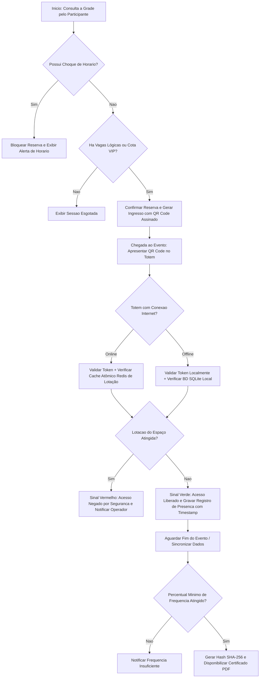
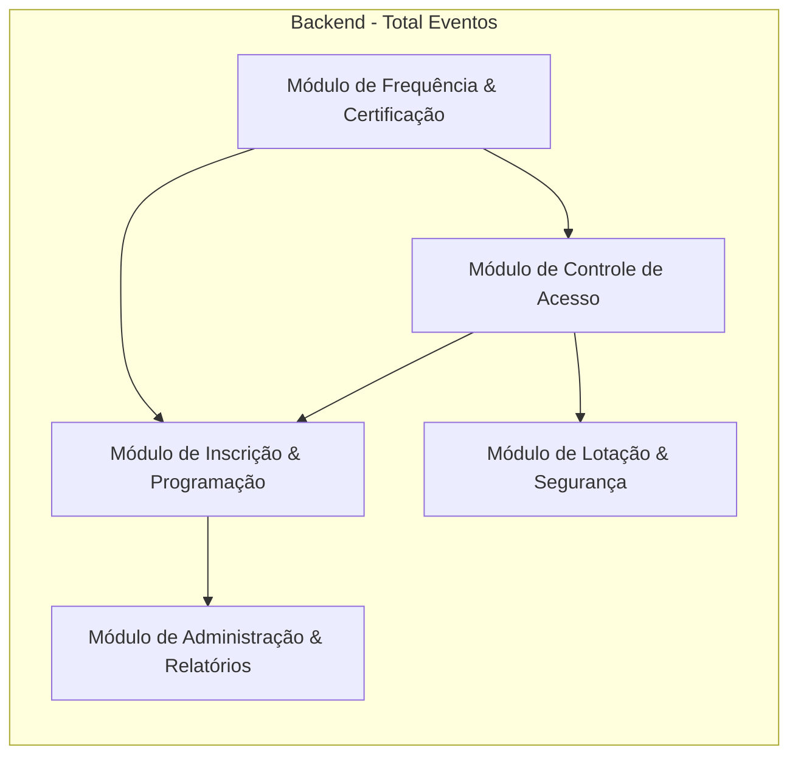

# Documento de Revisão Arquitetural Baseada na Evolução do Conhecimento do Domínio (Segunda entrega 3)

**Sistema Analisado:** Total Eventos  
**Disciplina:** Desenvolvimento de Software Corporativo  
**Alunos:** Luiz Henrique, Fernando Villar, Emmanuelly Madeira  
**Data:** 14 de Setembro de 2026  

---

## 1. Síntese da Arquitetura Inicial (Primeira entrega 1)

A proposta originalmente apresentada no primeira entrega estruturou o sistema **Total Eventos** sob as seguintes premissas:

* **Sistema Analisado:** Plataforma corporativa de organização e gestão operacional de eventos.
* **Problema Central:** Em eventos de médio e grande porte, a gestão descentralizada e manual provoca filas extensas no credenciamento, sobrecarga física em auditórios, choques de horário e falhas no cômputo de frequência para emissão de certificados.
* **Principais Atores:** Participante, Comissão Organizadora, Recepcionista / Totem, Palestrante e Sistema Externo de Assinatura Digital / Email.
* **Módulos Propostos:**
  1. *Módulo de Inscrição e Programação*;
  2. *Módulo de Controle de Acesso e Credenciamento*;
  3. *Módulo de Lotação e Segurança*;
  4. *Módulo de Frequência e Certificação*;
  5. *Módulo de Administração e Relatórios*.
* **Arquitetura em Camadas:** Divisão clássica em Apresentação (APIs / Apps / Web), Aplicação (Casos de Uso), Domínio (Entidades e Regras de Lotação/Presença) e Persistência (PostgreSQL, Cache Redis e SQLite Local).
* **Fluxo Principal:** Escolha de sessão pelo participante, validação de capacidade, confirmação da reserva com QR Code, credenciamento presencial no leitor/totem, cômputo de carga horária e emissão do certificado em PDF.
* **Principais Desafios Arquiteturais:** Disponibilidade e resiliência em redes instáveis, prevenção de overbooking em picos concorrentes e segurança contra duplicidade/fraude de QR Code.
* **Decisão do ADR-001:** Mecanismo de credenciamento presencial *Offline-First* no totem/dispositivo leitor com reconciliação assíncrona pós-reconexão.
* **Cenário de Evolução Considerado:** Transição para suporte a eventos híbridos multi-sede internacionais com validação biométrica facial voluntária no leitor.

---

## 2. Descobertas do Trabalho 2 com Impacto Arquitetural

A análise aprofundada das regras de negócio, invariantes, estados e incertezas no Trabalho 2 trouxe descobertas cruciais que impactam a arquitetura inicial:

| Descoberta do Trabalho 2 | Elementos Envolvidos | Possível Impacto Arquitetural | Grau de Certeza |
| :--- | :--- | :--- | :--- |
| Conflitos de duplo check-in durante o modo offline em múltiplos leitores podem resultar em ocupação real acima da capacidade máxima permitida. | Módulo de Controle de Acesso, Módulo de Lotação, *Redis Cache*, *SQLite Local*. | Exige um mecanismo explícito de reconciliação e controle de contenção quando totens reconectam simultaneamente. | **Confirmado** |
| Invariante rígida de segurança contra incêndios: A entrada presencial deve ser fisicamente bloqueada assim que a lotação atinja o limite físico legal, independentemente do status de reserva prévia. | Entidade Espaço Físico / Sala, Regra de Lotação, Módulo de Lotação. | A validação de lotação precisa migrar do momento da inscrição para uma verificação de alta velocidade em nível de leitor no ato do check-in. | **Confirmado** |
| Desistência da validação por geolocalização por falta de precisão em auditórios fechados. | Mecanismo de Check-in no App Mobile. | Consolidação do totem leitor com QR Code como único canal oficial de check-in. | **Confirmado** |
| Regras de cota de segurança VIP / Palestrantes que reservam até 10% da sala em separado. | Entidade Inscrição/Ingresso, Regras de Reserva, Módulo de Inscrição. | Necessidade de tratar categorias diferenciadas de ingresso dentro da lógica de ocupação e saldo de vagas. | **Confirmado** |
| A verificação de presença exige janela temporal permitida (ex: 30 minutos antes até 15 minutos após o início da sessão). | Entidade Sessão, Registro de Presença, Módulo de Controle de Acesso. | O leitor local precisa ter sincronizado o quadro completo de horários e sessões ativas no dispositivo. | **Confirmado** |

---

## 3. Revisão da Descrição do Problema

* **Perguntas de Avaliação:**
  * O problema continua sendo compreendido da mesma forma? **Sim**. A dor de filas, choque de horários e perda de controle de lotação permanece central.
  * Alguma necessidade ganhou maior importância? **Sim**. A garantia de conformidade com normas de segurança contra incêndios e alvarás no credenciamento físico ganhou peso crítico em detrimento da mera conveniência do usuário.
  * Algum aspecto anteriormente tido como secundário tornou-se relevante? A prevenção do overbooking em ambientes *offline*.
  * Alguma hipótese anterior revelou-se incorreta? **Sim**. A hipótese de realizar check-in via geolocalização do smartphone do participante (H05) foi descartada por inconsistências de sinal em auditórios fechados.
* **Classificação:** **Refinado**
* **Justificativa:** O problema central de gestão operacional mantém-se totalmente válido, mas agora coloca a resiliência física de segurança (limite estrito de lotação) e a contingência offline do credenciamento como prioridades absolutas sobre recursos estéticos ou de conveniência remota.

---

## 4. Revisão dos Atores

| Ator | Situação Anterior (T1) | Situação Atual (T3) | Classificação | Justificativa |
| :--- | :--- | :--- | :--- | :--- |
| **Participante** | Navega na grade, reserva vagas, apresenta QR Code e baixa certificados. | Mantém todas as responsabilidades anteriores. | **Mantido** | Suas ações na jornada do usuário continuam exatamente as mesmas e são sustentadas pelas regras do domínio. |
| **Comissão Organizadora** | Cadastra eventos/salas, monitora presença em tempo real e emite atas. | Cadastra programação, define cotas VIP, encerra atas e atua em alertas de sobrepopulação. | **Refinado** | Incorporou o papel operacional de agir presencialmente quando o sistema bloqueia portas por overbooking offline. |
| **Recepcionista / Totem** | Operador/dispositivo que realiza leitura do QR Code. | Totem/leitor autônomo com inteligência de execução e banco de dados local (*Offline-First*). | **Refinado** | Deixou de ser visto como mero leitor e passou a ser tratado como um nó autônomo com processamento local. |
| **Palestrante** | Consulta agenda e visualiza métricas de público. | Consulta agenda e métricas. | **Mantido** | O escopo do ator permanece condizente com as necessidades do domínio. |
| **Sistema Externo de Assinatura Digital / Email** | Assina hash SHA-256 e envia e-mails. | Provedores externos integrados via API para disparo de mensagens e hashes de validação. | **Mantido** | Permanece isolado do domínio interno do sistema como um serviço complementar. |

---

## 5. Revisão dos Módulos do Sistema

| Módulo | Situação Anterior (T1) | Descoberta Relevante do Trabalho 2 | Situação Atual (T3) | Classificação | Justificativa |
| :--- | :--- | :--- | :--- | :--- | :--- |
| **Módulo de Inscrição e Programação** | Gerenciava catálogo, grade, reservas de vagas e agenda. | A validação de reservas exige tratamento de regras de choques de horário do participante e cotas VIP/especiais. | Trata o catálogo de sessões, choque de horários e a alocação lógica de vagas. | **Refinado** | O escopo foi delimitado para focar na reserva *lógica* de vagas, separando-se da entrada *física* em tempo real. |
| **Módulo de Controle de Acesso e Credenciamento** | Gerava QR Code, validava ingressos e sincronizava dados offline. | A verificação de integridade do token criptográfico com carimbo temporal ocorre localmente no totem leitor. | Responsável pela leitura, validação de tokens e execução do check-in no leitor. | **Refinado** | Teve suas responsabilidades clarificadas para focar no ciclo de leitura e autenticação do ingresso. |
| **Módulo de Lotação e Segurança** | Inspecionava limite físico em tempo real e aplicava regras de contingência. | É quem detém a responsabilidade de proteger a invariante de segurança física contra incêndios em tempo real. | Inspeciona e garante o limite máximo de participantes no espaço físico durante o credenciamento. | **Mantido** | O avanço do domínio provou que o isolamento desse módulo é essencial para garantir regras de segurança física. |
| **Módulo de Frequência e Certificação** | Computava permanência, gerava hash SHA-256 e emitia PDFs. | A emissão requer atingimento do percentual mínimo de presença (ex: 75%) e o encerramento formal do evento. | Consolida os registros de presença, avalia elegibilidade por carga horária e assina o PDF. | **Mantido** | A responsabilidade continua perfeitamente isolada e alinhada às operações de pós-evento. |
| **Módulo de Administração e Relatórios** | Fornecia dashboards, gestão de palestrantes e exportação de auditoria. | Precisa tratar alertas operacionais emitidos pela reconciliação de leitores offline. | Painel executivo de monitoramento, conciliação e gestão do evento. | **Refinado** | Incorporou o tratamento de relatórios de exceção e alertas de sobrepopulação. |

---

## 6. Revisão do Fluxo Principal

O fluxo principal foi expandido para detalhar explicitamente as transições de estado do leitor em modo offline, o tratamento de janelas de tempo e o bloqueio emergencial por atingimento de capacidade física:

* **Melhorias Incorporadas:**
* Inclusão clara da bifurcação de processamento entre o modo *Online* (validação atômica no Redis) e modo *Offline* (banco SQLite local).
* Representação explícita do bloqueio de segurança física.
* Tratamento de recusa por choque de horários na reserva prévia.

---

## 7. Revisão do Diagrama de Módulos

Não se identificou a necessidade de adicionar ou alterar drasticamente a quantidade de módulos, pois a divisão em 5 módulos proposta no primeira entrega se mostrou extremamente aderente às operações identificadas no Trabalho 2.

* **Diagrama Mantido:**

* **Explicação Textual:** A estrutura de dependências foi **Mantida**. O *Módulo de Controle de Acesso* consulta o *Módulo de Lotação* para assegurar a invariante física e interage com o *Módulo de Inscrição* para validar a autenticidade do ingresso. O *Módulo de Certificação* consome os eventos do *Controle de Acesso*. A manutenção do diagrama se justifica porque o conhecimento adquirido no Trabalho 2 reforçou a coesão de cada módulo.

---

## 8. Revisão da Arquitetura em Camadas

* **Perguntas de Avaliação:**
* *A camada de Domínio ganhou responsabilidades mais claras?* **Sim**. Passou a conter explicitamente as invariantes de Lotação Estrita, Regras de Cota VIP, Validação do Hash do Ingresso e Cálculo do Percentual Mínimo de Presença.
* *Alguma responsabilidade de Aplicação pertencia ao Domínio?* O cálculo de saldo de vagas e a verificação do teto de capacidade física ficavam diluídos no caso de uso; agora pertencem integralmente a entidades do Domínio (`EspacoFisico` / `Sessao`).
* *A separação entre Domínio e Persistência continua clara?* **Sim**. A Persistência apenas expõe as interfaces dos repositórios (SQL central, Redis Cache e SQLite local no totem).

* **Classificação:** **Refinado**
* **Justificativa:** O estilo arquitetural em 4 camadas (Apresentação, Aplicação, Domínio e Persistência) continua ideal, tendo apenas passado por um refinamento na alocação de responsabilidades para assegurar que regras puras de negócio não vazem para a camada de Aplicação.

---

## 9. Revisão dos Desafios Arquiteturais

| Desafio | Já existia no T1? | Evidência Atual (T3) | Impacto | Situação |
| --- | --- | --- | --- | --- |
| **Disponibilidade e Resiliência em Redes Instáveis** | Sim | Centros de convenções apresentam perda frequente de conectividade. | Alto: Exige execução autônoma do aplicativo do totem leitor com SQLite local. | **Mantido** |
| **Consistência de Lotação e Prevenção de Overbooking** | Sim | Invariante rígida de segurança contra incêndios que proíbe entradas além do limite legal. | Crítico: Pode provocar paralisação de check-in e alertas em tempo real se leitores operarem offline. | **Refinado** |
| **Segurança e Anti-Fraude de Ingressos** | Sim | Tentativas de reapresentação do mesmo QR Code por múltiplos participantes em leitores diferentes. | Médio: Necessita de verificação de timestamp e chave HMAC assinada localmente. | **Mantido** |
| **Reconciliação Concorrente de Múltiplos Nó Offline** | Não | Descoberta Q01/D01: Totens operando sem rede local aceitam entradas que, quando somadas no servidor central, estouram a capacidade da sala. | Crítico: Exige algoritmos de detecção de conflitos no servidor pós-reconexão e emissão de alertas imediatos. | **Novo** |

---

## 10. Revisão do ADR-001

### **ADR-001 (Revisado): Mecanismo de Credenciamento Presencial Offline-First no Totem com Estratégia de Reconciliação**

* **Status:** **Revisado**
* **Contexto:** Em grandes centros de convenções, a conectividade é instável. A parada no fluxo de entrada é inaceitável. No entanto, a execução *Offline-First* em múltiplos totens de uma mesma porta/sala sem comunicação de rede pode gerar sobrepopulação pontual pós-sincronização.
* **Decisão Anterior (T1):** Adotar arquitetura de dados *Offline-First* nos dispositivos leitores salvando dados localmente em SQLite e sincronizando em segundo plano.
* **Revisão/Evolução (T3):** Mantém-se o modelo *Offline-First*, mas **adiciona-se a regra de contenção de margem offline**: dispositivos operando offline utilizarão uma reserva de saldo local pré-alocada (ex: teto máximo de 95% da sala para totens offline). Ao atingir esse teto em modo offline, o leitor bloqueia preventivamente novos check-ins e exige validação via rede ou autorização presencial do organizador.
* **Consequências Mantidas e Novas:**
* *Benefício:* Mantém credenciamento ultra-rápido (< 150ms) e imune a quedas de Wi-Fi.
* *Novo Risco Mitigado:* Elimina o risco de grande sobrepopulação em salas no momento de reconexão de múltiplos totens offline.

---

## 11. Revisão da Funcionalidade Inovadora

**Funcionalidade:** *Smart Queue & Dynamic Capacity Redistribution (Redistribuição Dinâmica por Heatmap)*

* **Classificação:** **Refinada**
* **Análise de Aderência ao Domínio:**
* Continua atendendo a uma necessidade real de maximizar o uso de auditórios ociosos por *no-show*.
* O Trabalho 2 confirmou a hipótese H03 de que taxas de ausência em congressos chegam a 30%, tornando a funcionalidade ainda mais relevante.
* **Refinamento:** O disparo de liberação automática de vagas de *no-show* só pode ocorrer se o *Módulo de Lotação* confirmar que os totens da sala estão online e sincronizados. Caso o leitor da sala esteja offline, a liberação de *no-show* é pausada para impedir sobrepopulação no local.

---

## 12. Revisão do Cenário de Evolução

**Cenário de Mudança:** Suporte a *Eventos Híbridos Multi-Sede Internacionais com Validação Biométrica Facial Voluntária*.

1. **O que permanece na arquitetura?**
Toda a estrutura de validação de carga horária, emissão de certificados com hash SHA-256 e o modelo em camadas.
2. **O que precisaria ser alterado?**
O leitor leitor/totem no Módulo de Controle de Acesso incorporará biblioteca de processamento de vetores biométricos (*Edge Computing*).
3. **Alguma decisão precisaria ser revista?**
Sim. O armazenamento de vetores faciais nos bancos SQLite locais dos totens exigirá rotinas imediatas de purga de memória e criptografia conforme a LGPD/GDPR.
4. **A arquitetura favorece ou dificulta?**
**Favorece**. O isolamento modular do *Controle de Acesso* permite que a biometria atue como mais uma forma de autenticação do ingresso sem impactar a regra de lotação ou a certificação.

---

## 13. Matriz Geral de Evolução Arquitetural

| Elemento | Situação no primeira entrega | Situação Atual (T3) | Classificação | Evidência que sustenta a decisão |
| --- | --- | --- | --- | --- |
| **Problema** | Filas e descontrole no credenciamento. | Foco em fluidez do acesso e garantia de conformidade legal de lotação. | **Refinado** | Invariantes de segurança contra incêndios mapeadas no T2. |
| **Atores** | 5 atores mapeados. | Totem refinado como nó autônomo com inteligência local. | **Refinado** | Necessidade de autonomia offline comprovada na D01. |
| **Módulos** | 5 módulos funcionais. | Módulos mantidos com responsabilidades mais delimitadas. | **Refinado** | Adoção das operações derivadas do fluxo principal. |
| **Fluxo** | Fluxo linear de reserva e credenciamento. | Incorporação do bloqueio de emergência e bifurcação online/offline. | **Alterado** | Mapeamento das variações e situações de falha no T2. |
| **Arquitetura em Camadas** | 4 camadas padrão. | Domínio isolado abrigando todas as regras puras. | **Refinado** | Prevenção de vazamento de regras de negócio para a aplicação. |
| **Desafios** | Redes instáveis, overbooking e fraude. | Adicionado o desafio de Reconciliação Concorrente Offline. | **Refinado** | Incerteza Q01 e decisão D01 identificadas no T2. |
| **ADR-001** | *Offline-First* simples. | *Offline-First* com teto e margem de contenção local. | **Revisado** | Risco de estouro de lotação ao reconectar múltiplos totens. |
| **Funcionalidade Inovadora** | Redistribuição dinâmica por *heatmap*. | Condicionada à sincronização online dos totens da sala. | **Refinada** | Invariante de lotação física máxima. |
| **Cenário de Evolução** | Expansão biométrica facial. | Mantido com acréscimo de diretrizes rígidas de descarte LGPD. | **Refinado** | Apêndice de compliance e privacidade de dados. |

---

## 14. Decisões que ainda NÃO podem ser tomadas

| Questão | Por que ainda não podemos decidir? | Que informação falta? | Possível Impacto |
| --- | --- | --- | --- |
| **Definição de Bounded Contexts e Microsserviços Definitivos** | O monólito modular atende perfeitamente ao volume atual e simplifica o ambiente de desenvolvimento. | Dados reais de volumetria de concorrência simultânea em eventos de grande escala. | Mudança na estratégia de implantação de monólito para microsserviços distribuídos. |
| **Banco de Dados Físico para o Cache Distribuído** | Não avaliamos a infraestrutura física dos centros de convenções clientes. | Informações de contrato sobre disponibilização de hardware local pelos organizadores. | Escolha entre Redis clusterizado na nuvem vs. instância Redis local em servidor de borda no evento. |
| **Taxa Exata de Margin de Overbooking Permitida na Reserva Lógica** | Varia de acordo com o regulamento interno e alvará de cada centro de convenções. | Definições jurídicas e de compliance da comissão de cada evento. | Regra configurável por parâmetro de software na criação da palestra. |

---

## 15. Reflexão Arquitetural

* **Qual decisão do primeira entrega foi mais fortalecida pelo Trabalho 2?**
A adoção da estratégia *Offline-First* no dispositivo leitor (ADR-001). Toda a análise do domínio confirmou que a perda de sinal de internet é a regra, e não a exceção, em grandes auditórios.
* **Qual decisão ficou mais frágil?**
A suposição implícita de que múltiplos totens operando offline simultaneamente conseguiriam manter a precisão exata do contador de lotação. Isso exigiu refinar o ADR-001 para incluir margens de contenção local.
* **Qual alteração foi mais significativa?**
A inclusão de bloqueios físicos imediatos no fluxo de credenciamento e o condicionamento da funcionalidade inovadora ao status de sincronização dos leitores.
* **Alguma Regra de Negócio ou Invariante mudou a compreensão sobre responsabilidades?**
Sim. A invariante legal de limite máximo de ocupação por segurança contra incêndio mostrou que o *Módulo de Lotação e Segurança* deve ter autoridade máxima sobre a liberação do acesso no leitor, sobrepondo-se inclusive ao status de reserva do participante.
* **O que a equipe aprendeu sobre a relação entre conhecimento de domínio e arquitetura?**
A equipe compreendeu que a arquitetura não deve ser desenhada para cenários ideais do ponto de vista tecnológico, mas sim adaptada para suportar as restrições e falhas do ambiente real onde o negócio opera.

**Defesa do Sistema:**

Se precisássemos defender hoje a arquitetura do **Total Eventos** diante de outro arquiteto, conseguiríamos **justificar com total segurança** o isolamento dos 5 módulos, a estratégia *Offline-First* no totem com banco local e a verificação em camadas para certificação. Por outro lado, reconhecemos que **ainda precisamos investigar** com dados empíricos a taxa perfeita de margem de contingência offline para totens desconectados em salas de altíssima capacidade.
